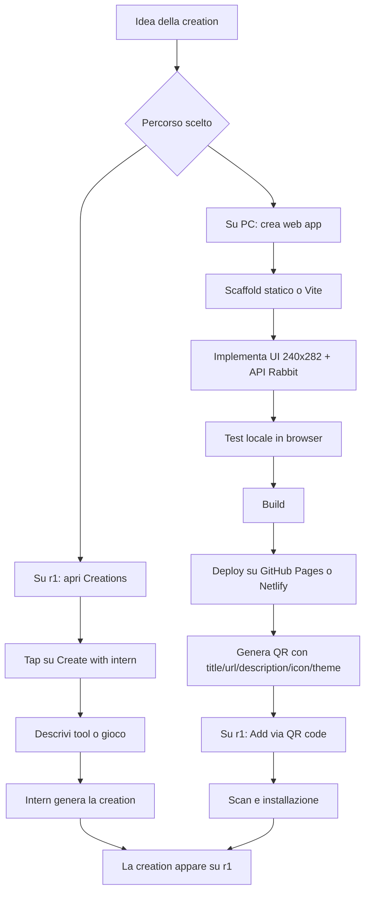

# Rabbit r1 rabbitOS 2 e sviluppo di creations

## Executive summary

La documentazione pubblica per sviluppare **creations** su Rabbit r1 con **rabbitOS 2** esiste, ma oggi è ancora **incompleta e non versionata come un SDK classico**. Le fonti ufficiali più utili sono: la pagina di lancio di **rabbitOS 2**, la pagina **Updates**, l’articolo di supporto **How to use r1 creations**, la guida utente r1, e soprattutto il repository ufficiale **`rabbit-hmi-oss/creations-sdk`**. Da queste fonti emerge che una creation è, in pratica, una **mini‑app web ottimizzata per r1**, installabile via **generazione vocale con rabbit intern** oppure via **hosting esterno + QR code**. Tuttavia, Rabbit non pubblica ancora un **CLI ufficiale**, un **manifest versionato**, un **emulatore locale** o uno **SDK con release/tag**: il repo ufficiale dichiara ancora “Soon”, contiene soprattutto i sample `plugin-demo` e `qr`, e non ha release pubblicate. citeturn20view0turn20view1turn9view0turn39view0

Dal punto di vista operativo, il percorso più solido oggi è questo: sviluppare una **web app statica** o quasi‑statica, rispettare il layout **240×282 px**, usare le **API JavaScript iniettate** dal runtime Rabbit quando servono funzioni specifiche del device, testare prima in browser con fallback/mocking, pubblicare su **GitHub Pages** o **Netlify**, poi generare un **QR** con i campi richiesti (`title`, `url`, `description`, `iconUrl`, `themeColor`) e installare la creation su r1 dal card stack. Per chi non vuole scrivere codice, la route ufficiale resta il card **Creations → Create with intern**, con consumo di **intern tasks**. citeturn9view0turn21view0turn15view0turn18view4turn34view0

L’API pubblica disponibile oggi è piccola ma concreta: `PluginMessageHandler`, `window.onPluginMessage`, `closeWebView`, `TouchEventHandler`, `window.creationStorage.plain/secure`, `window.creationSensors.accelerometer`, e gli eventi hardware `sideClick`, `longPressStart`, `longPressEnd`, `scrollUp`, `scrollDown`; per microfono, camera e speaker Rabbit rimanda alle **normali tecnologie web mobile**. Questo conferma un’architettura **ibrida**: UI/app nel WebView del dispositivo, capacità agentiche/LLM sul backend Rabbit, e gran parte del compute di rabbitOS delegato al cloud. citeturn21view0turn21view1turn37view0

Il punto più importante, in termini di rigore, è che **alcune fonti ufficiali non sono perfettamente allineate tra loro**. L’articolo support dichiara ancora che le creations fatte con intern “non possono” usare STT o backend hosted; però le release notes ufficiali del team per **rabbitOS 2.1** mostrano nuove creations e invitano esplicitamente a crearne con **speech‑to‑text**, segno che almeno la parte STT è stata ampliata o la pagina support non è aggiornata. Per questo, conviene trattare la documentazione ufficiale attuale come **preliminare**, e verificare sempre anche **Updates** e **release notes del forum ufficiale**. citeturn9view0turn32view0turn20view1

## Stato attuale di rabbitOS 2 e della documentazione

Rabbit presenta **rabbitOS 2** come la “second generation” del proprio sistema operativo AI‑centric per r1, con interfaccia a card, conversazione multimodale e capacità agentiche nuove tramite **creations**. Nel changelog pubblico ufficiale, il lancio di **rabbitOS 2** è datato **8 settembre 2025**, mentre la milestone semantica più recente trovata è **rabbitOS 2.1** del **6 aprile 2026**, che aggiunge tra l’altro **PIN lock**, redesign del card “creations” e opzioni di personalizzazione ulteriori. citeturn20view0turn20view1

A livello architetturale, Rabbit descrive `rabbit OS` come un sistema costruito sul **Large Action Model**, con forte appoggio a un **cloud customizzato** per comprendere intenzioni, agire sulle interfacce e delegare operazioni in sicurezza via **rabbithole**. Nelle fonti ufficiali sulle creations, la parte applicativa è invece esposta come una surface **web‑first**: il sample ufficiale è un sito statico HTML/CSS/JavaScript, il runtime inietta canali JS specifici del dispositivo, e le richieste al modello passano via `PluginMessageHandler` verso il backend Rabbit. La conclusione pratica è che, allo stato pubblico attuale, lo sviluppo di una creation assomiglia più allo sviluppo di una **mini web app embedded** che a un’app nativa tradizionale. citeturn37view0turn21view0turn6view0

La documentazione per sviluppatori è ufficialmente pubblica ma ancora embrionale. Il repository `rabbit-hmi-oss/creations-sdk` si presenta come “rabbit r1 creations docs for devs”, però nel README dice ancora **“Soon”**, include sostanzialmente solo `plugin-demo` e `qr`, e non pubblica release. Questo implica che, oggi, la documentazione “vera” è distribuita tra **support article**, **sample code**, **repo GitHub** e **release notes**, non in un portale SDK unico e stabilizzato. citeturn39view0

| Voce | Stato pubblico rilevato | Implicazione pratica | Fonte |
|---|---|---|---|
| rabbitOS 2 | Lanciato l’8 settembre 2025 come nuova esperienza card‑based e multi‑agent | È il baseline funzionale di riferimento per creations | Newsroom / Updates citeturn20view0turn20view1 |
| rabbitOS 2.1 | Milestone del 6 aprile 2026 con redesign del card creations, PIN lock, quick‑launch più ricco | È la milestone “corrente” più utile per validare comportamento UI/UX | Updates citeturn20view1 |
| SDK pubblico | Repo ufficiale presente ma README “Soon”, solo sample `plugin-demo` e `qr` | Non esiste ancora un SDK pubblico versionato con release/CLI ufficiale | GitHub repo ufficiale citeturn39view0 |
| Stack agentico | Il 6 febbraio 2026 Rabbit ha dichiarato di aver spostato intern/creations/DLAM su Claude Opus 4.6 | Il modello backend può cambiare server‑side; non conviene hardcodare assunzioni sul modello | Forum ufficiale release notes citeturn32view0 |

### Superficie API disponibile

Le API pubbliche esposte dal sample/documento ufficiale sono queste.

| API o canale | Cosa fa | Note operative | Fonte |
|---|---|---|---|
| `PluginMessageHandler.postMessage(...)` | Invia messaggi strutturati al server Rabbit | Supporta `useLLM`, `wantsR1Response`, `wantsJournalEntry`; il `pluginId` viene iniettato/forzato dal sistema | `creation-triggers.md` citeturn21view0turn21view1 |
| `window.onPluginMessage` | Riceve la risposta dal server | La risposta può arrivare in `data.data` come JSON string o in `data.message` come testo | `creation-triggers.md` + `plugin-demo` citeturn21view1turn6view1 |
| `closeWebView.postMessage("")` | Chiude la WebView e torna alla home | Utile per pulsante “Quit/Back to home” | `creation-triggers.md` citeturn21view1 |
| `TouchEventHandler.postMessage(...)` | Simula eventi touch | Pensato per automazione/accessibilità; eventi tipo `tap`, `down`, `up`, `move`, `cancel` | `creation-triggers.md` citeturn21view1turn21view2 |
| `window.creationStorage.plain` | Storage persistente non cifrato | Tutti i dati vanno Base64‑encodati; storage isolato per plugin ID | `creation-triggers.md` citeturn21view0 |
| `window.creationStorage.secure` | Storage persistente cifrato hardware | Richiede Android M o superiore; utile per segreti locali minimi | `creation-triggers.md` citeturn21view0 |
| `window.creationSensors.accelerometer` | Accesso accelerometro real‑time | `isAvailable()`, `start(cb,{frequency})`, `stop()`; valori normalizzati e raw | `creation-triggers.md` + `plugin-demo` citeturn21view0turn8view2 |
| Eventi `sideClick`, `longPressStart`, `longPressEnd`, `scrollUp`, `scrollDown` | Accesso a PTT/side button e scroll wheel | Confermano integrazione con l’hardware r1 | `creation-triggers.md` + `plugin-demo` citeturn21view1turn8view1 |
| API web standard | Camera, microfono, speaker | Rabbit parla esplicitamente di “standard mobile web technologies” | `creation-triggers.md` citeturn21view0 |

## Definizione di creation e prerequisiti

Nel lessico ufficiale Rabbit, una **creation** è una **custom AI generated mini‑application** per rabbit r1: può essere un tool, un gioco o un’utility, ed è progettata per usare i tratti distintivi dell’hardware r1, inclusi **PTT**, **scroll wheel**, **microfono**, **camera rotante**, **speaker** e **accelerometro**. Rabbit dice anche che ci sono **due modi** per crearla: **parlando con r1** oppure usando **third‑party tools**; l’installazione può avvenire via **QR code** o dalla scheda pubblica del dispositivo. citeturn9view0

Per la route **voice‑first**, il prerequisito funzionale è avere un r1 attivato, connesso e aggiornato, oltre a task disponibili in **rabbit intern**: per le nuove utenze Rabbit dichiara **3 task gratuiti** iniziali, con un task consumato per creazione/follow‑up. Per la route **third‑party**, i prerequisiti ufficiali sono più semplici ma più manuali: hosting della creation, generazione QR, e installazione sul device tramite scansione. citeturn9view0turn23view0

Dal punto di vista hardware, r1 offre un display touch **2,88"**, processore **Helio P35**, **4 GB RAM**, **128 GB storage**, speaker **2 W**, doppio microfono, accelerometro/giroscopio, camera da **8 MP**, connettività Wi‑Fi/4G/BT e USB‑C. Questi dati contano soprattutto perché Rabbit avverte esplicitamente che il device ha **potenza limitata**, poco spazio per file pesanti e che **una sola creation può girare alla volta**. citeturn24view0turn9view0

| Prerequisito | Obbligatorio? | Dettaglio pratico | Fonte |
|---|---|---|---|
| rabbit r1 attivato | Sì | Serve account rabbithole, linking via QR e setup iniziale | Setup r1 / rabbithole citeturn23view0turn36view0 |
| Connessione internet | Sì | Necessaria per setup, OTA e funzioni AI/cloud | Setup r1 / user guide citeturn23view0turn24view2 |
| rabbitOS 2 o successivo | Di fatto sì | Dopo l’aggiornamento a rabbitOS 2 il touch è disponibile pienamente | Setup r1 / Updates citeturn23view0turn20view1 |
| intern tasks | Solo per route vocale | 3 task gratuiti iniziali per nuovi account; 1 task per creazione/follow‑up | Support creations citeturn9view0 |
| PC desktop per usare intern web | Opzionale ma utile | Intern web non è ottimizzato per smartphone/tablet e può generare `.html`, `.json`, `.md` | Support intern citeturn22view0 |
| Node.js | Non obbligatorio per Rabbit, utile per dev moderno | Vite richiede Node 20.19+ o 22.12+; Netlify CLI 18.14+ | Vite / Netlify citeturn31view2turn34view2 |
| Hosting web | Sì per route third‑party | Rabbit cita esplicitamente GitHub Pages e Netlify come opzioni usate dalla community | Support creations citeturn9view0 |

## SDK, toolchain, comandi e template

La combinazione più “allineata” con la documentazione ufficiale oggi è: **HTML/CSS/JavaScript statico**, design per **240×282 px**, uso selettivo delle API Rabbit quando sei realmente su r1, e hosting web esterno. Il sample `plugin-demo` ufficiale è esattamente questo: una SPA statica, con menu, hardware events, accelerometro, interazione LLM e TTS, e senza uso diretto di WebSocket. citeturn6view0turn6view1

Se vuoi una toolchain moderna, **Vite** è una buona scelta pratica ma **non è Rabbit‑specifica**: serve per sviluppare e buildare la web app più comodamente. Per il deploy, **GitHub Pages** e **Netlify** sono le due opzioni più coerenti con quanto Rabbit cita nel support. GitHub Pages è ottimo per siti statici semplici; Netlify è più comodo se vuoi preview deploy, CLI e log di deploy migliori. citeturn9view0turn31view2turn34view2turn18view4

### Confronto tra tool e percorsi

| Tool o percorso | Tipo | Quando conviene | Punti forti | Limiti | Fonte |
|---|---|---|---|---|---|
| **Create with intern** su r1 | No/low‑code ufficiale | Vuoi creare direttamente dal device parlando | Deploy immediato sul device; esperienza nativa Rabbit | Consuma task; documentazione tecnica poco osservabile; feature route storicamente limitata | Support creations / rabbitOS 2 launch citeturn9view0turn20view0 |
| **HTML/CSS/JS statico** | Approccio pratico ufficiale‑compatibile | Vuoi controllo tecnico pieno e compatibilità massima | È il formato del sample ufficiale; zero lock‑in | Devi gestire hosting e QR da solo | `plugin-demo` / GitHub Pages doc citeturn6view0turn18view3 |
| **Vite** | Toolchain opzionale generica | Vuoi dev server, modularità e build | `dev`, `build`, `preview`, entry front‑and‑center su `index.html` | Non è documentato da Rabbit come standard ufficiale | Vite docs citeturn31view2 |
| **GitHub Pages** | Hosting statico | Creation semplice, repository già su GitHub | Niente backend necessario; publishing da branch o Actions | Sito pubblico sul web; attenzione a segreti e dati sensibili | GitHub Docs citeturn18view3turn18view4 |
| **Netlify** | Hosting/static deploy + CLI | Vuoi preview deploy, CLI e log | `netlify deploy`, draft URL, deploy prod, debug CLI | Richiede Node/CLI; devi gestire account/token | Netlify Docs citeturn34view0turn34view1turn34view2 |

### Comandi principali

| Comando o azione | Uso | Nota pratica | Fonte |
|---|---|---|---|
| `npm create vite@latest my-r1-creation -- --template vanilla` | Scaffold rapido di una web app minimale | Per un progetto Rabbit conviene partire da `vanilla` o `vanilla-ts` | Vite docs citeturn31view2 |
| `npm install` | Installa dipendenze del progetto | Standard dopo scaffold | Vite docs citeturn31view2 |
| `npm run dev` | Avvia il dev server | In Vite mappa a `vite` / `vite serve` | Vite docs citeturn31view2 |
| `npm run build` | Build di produzione | Mappa a `vite build` | Vite docs citeturn31view2 |
| `npm run preview` | Preview locale del build | Utile prima del deploy | Vite docs citeturn31view2 |
| `npm install -g netlify-cli` | Installa Netlify CLI globalmente | Netlify richiede Node 18.14+ | Netlify docs citeturn34view2 |
| `netlify login` | Autentica la CLI | Ottiene e salva il token | Netlify docs citeturn34view2 |
| `netlify deploy` | Draft deploy / preview URL | Il primo deploy linka o crea il sito | Netlify docs citeturn34view0turn34view1 |
| `netlify deploy --prod` | Deploy in produzione | Pubblica sulla URL principale del sito | Netlify docs citeturn34view0turn34view1 |
| `DEBUG=* netlify deploy` | Debug verbose del deploy | Utile se il packaging fallisce | Netlify docs citeturn34view0 |
| GitHub Pages → *Deploy from a branch* oppure *GitHub Actions* | Pubblicazione su GitHub Pages | Richiede `index.html` al top level dell’output | GitHub Docs citeturn18view3turn18view4 |

### Confronto tra template ed esempi

| Template / esempio | Stato | Cosa mostra | Perché usarlo | Fonte |
|---|---|---|---|---|
| `plugin-demo` | **Ufficiale** | Layout 240×282, hardware buttons, accelerometro, chat LLM, TTS, storage | È il miglior punto di partenza tecnico ufficiale | Repo ufficiale + README citeturn6view0turn6view1 |
| `qr/final` | **Ufficiale** | Generatore QR con campi `title`, `url`, `description`, `iconUrl`, `themeColor` | Serve per packaging/instal­lazione third‑party | Repo ufficiale QR citeturn15view0 |
| Spotify Miniplayer | **Community** | Uso di scroll wheel e side buttons, UI 240 px, persistenza sessione | Buon esempio di creation “vera” ma non ufficiale | atomlabor repo citeturn38view0 |
| r1-map | **Community** | Avvio rapido da `index.html`, progetto leggero per r1, touch pieno | Esempio utile di app statica semplice e veloce | atomlabor repo citeturn38view1 |

Una struttura minima, molto vicina al sample ufficiale, è questa. Il `plugin-demo` usa precisamente `index.html`, una cartella CSS, una cartella JS con moduli separati, e un documento di reference per i trigger/API Rabbit. citeturn6view0

```text
my-r1-creation/
├── index.html
├── css/
│   └── styles.css
├── js/
│   ├── app.js
│   ├── hardware.js
│   ├── data.js
│   └── speak.js
└── reference/
    └── creation-triggers.md
```

Un `package.json` minimo, coerente con l’uso di Vite, è questo. La documentazione Vite espone gli script standard `dev`, `build` e `preview`. citeturn31view2

```json
{
  "scripts": {
    "dev": "vite",
    "build": "vite build",
    "preview": "vite preview"
  }
}
```

Per l’installazione via QR, il generatore ufficiale espone pubblicamente questi campi di configurazione: `title`, `url`, `description`, `iconUrl`, `themeColor`. L’esempio sotto è un adattamento pratico del formato visibile nella pagina ufficiale. citeturn15view0

```json
{
  "title": "Mia Creation",
  "url": "https://example.com/",
  "description": "Mini-app per rabbit r1",
  "iconUrl": "https://example.com/icon.png",
  "themeColor": "#FE5000"
}
```

## Workflow pratico di sviluppo e deploy

Il workflow ricostruibile dalle fonti ufficiali ha due rami: **voice‑first on device** e **third‑party web app**. Nel primo caso la creation nasce e compare direttamente su r1; nel secondo scrivi/ospiti una web app, generi un QR e la installi dal card “creations”. citeturn9view0turn20view0



Per il ramo **on device**, Rabbit documenta una sequenza molto lineare: apri il card **creations**, scegli **create with intern**, segui i prompt del rabbit agent, e la mini‑app viene generata sul device. Questo è il percorso più rapido, ma è anche quello meno trasparente dal punto di vista di file, build e debugging. Inoltre dipende da **intern tasks**. citeturn9view0turn20view0

Per il ramo **third‑party**, il procedimento più robusto oggi è:

1. **Scaffold o prepara la web app**. Se vuoi stare vicinissimo al materiale ufficiale, puoi anche partire da puro statico HTML/CSS/JS. Se vuoi una toolchain moderna, Vite è il compromesso più semplice. Rabbit non prescrive Vite, ma il suo sample ufficiale è già una web app statica. citeturn6view0turn31view2

   ```bash
   npm create vite@latest my-r1-creation -- --template vanilla
   cd my-r1-creation
   npm install
   npm run dev
   ```

2. **Disegna per il viewport di r1**. Rabbit impone **240×282 portrait** e raccomanda codice leggero: poche operazioni DOM, preferenza per `transform`/`opacity`, animazioni CSS semplici. citeturn21view0turn6view0

3. **Integra le API Rabbit dove serve**. Il pattern minimo ufficiale è: inviare payload con `PluginMessageHandler`, ricevere il risultato in `window.onPluginMessage`, aggiungere storage Base64 dove serve, e verificare la disponibilità delle API nei test browser. citeturn21view0turn6view1turn8view1turn8view2

   ```js
   // esempio adattato dal pattern ufficiale
   const payload = {
     message: "Dammi 3 consigli rapidi per organizzare una scrivania",
     useLLM: true,
     wantsR1Response: false,
     wantsJournalEntry: true
   };

   if (typeof PluginMessageHandler !== "undefined") {
     PluginMessageHandler.postMessage(JSON.stringify(payload));
   }

   window.onPluginMessage = (evt) => {
     const parsed = evt.data ? JSON.parse(evt.data) : null;
     console.log("messaggio:", evt.message, "data:", parsed);
   };
   ```

4. **Testa localmente**. Vite serve `index.html` come entry point e fornisce `dev`, `build`, `preview`; GitHub Pages richiede comunque che l’entry file del sito pubblicato sia `index.html` (oppure `index.md` / `README.md`, ma per Rabbit la scelta naturale è `index.html`). citeturn31view2turn18view3

   ```bash
   npm run build
   npm run preview
   ```

5. **Pubblica**. Con GitHub Pages puoi pubblicare da branch o da GitHub Actions; con Netlify puoi usare preview deploy e poi produzione. Se il build è custom, GitHub consiglia Actions; se serve evitare il build Jekyll predefinito, usa `.nojekyll`. citeturn18view4turn18view3

   ```bash
   npm install -g netlify-cli
   netlify login
   netlify deploy
   netlify deploy --prod
   ```

6. **Genera il QR e installa su r1**. Qui il repo ufficiale `qr` è fondamentale. Una volta ottenuto il QR, su r1 vai in **creations → add via QR code**, scansioni e installi. In alternativa puoi installare creations esistenti dalla scheda **public**. citeturn15view0turn9view0

Se vuoi usare **rabbit intern** come assistente di coding e non solo come creatore vocale su r1, la documentazione ufficiale dice che intern può generare file plaintext come `.html`, `.json` e `.md`, pubblicare un risultato web, e non è ottimizzato per browser mobili. È quindi un buon supporto per **bozzare** una creation, ma la documentazione Rabbit sulle creations continua comunque a indicare il flusso third‑party come **hosting + QR**. citeturn22view0turn9view0

## Sicurezza, dipendenze, debugging e logging

Sul piano della sicurezza, Rabbit offre alcuni meccanismi chiari nella surface pubblica. Il più importante è che il `pluginId` delle messages viene **iniettato/forzato dal sistema** per prevenire spoofing; inoltre lo storage di una creation è **isolato per plugin ID**, e l’area `secure` è descritta come **hardware‑encrypted**. In parallelo, Rabbit posiziona **rabbithole** come hub cloud sicuro per log, memorie e agenti, e ribadisce di non memorizzare preventivamente credenziali e password di servizi terzi. citeturn21view0turn37view0turn36view0turn23view0

Per le dipendenze, il quadro ufficiale è volutamente leggero: il sample usa solo stack web standard e SDK iniettato. Le dipendenze “vere”, quindi, sono più che altro **scelte di toolchain** tue: Vite, GitHub Pages, Netlify, librerie front‑end eventuali. In pratica, i problemi più comuni non vengono da Rabbit “package dependencies”, ma da **API non disponibili fuori da r1**, encoding errato dello storage, permessi browser per camera/microfono, o da deploy statici mal configurati. citeturn6view0turn21view0turn31view2turn34view2

| Problema comune | Sintomo | Causa probabile | Mitigazione consigliata | Fonte |
|---|---|---|---|---|
| `PluginMessageHandler` non esiste | LLM/API Rabbit non rispondono in locale | Sei in browser normale, non nel runtime r1 | Aggiungi fallback browser‑mode e mock locali | `app.js` demo citeturn8view1 |
| `creationSensors` / accelerometro assente | Sensori non partono | API disponibile solo su device o non presente | Verifica `window.creationSensors`, chiama `isAvailable()`, fallback UI | `hardware.js` demo citeturn8view2 |
| Dati non persistono | Stato perso al riavvio | Mancato uso di storage o Base64 errato | Usa `creationStorage.plain/secure` con Base64 | `creation-triggers.md` citeturn21view0 |
| `mic access denied` | Intern voice mode non funziona | Permesso browser microfono negato | Correggi i permessi del browser | Support intern citeturn22view0 |
| Parse error su risposta LLM | `JSON.parse` fallisce | Il payload non è JSON valido o arriva in `message` | Gestisci sia `data.data` sia `data.message`, valida il JSON | `plugin-demo` + SDK doc citeturn6view1turn21view1 |
| Segreti esposti dopo il deploy | Token/API key visibili o abusabili | Hosting statico pubblico o repo pubblico | Non mettere segreti client‑side; usa storage secure solo per minimi dati locali; evita repo/site con dati sensibili | GitHub Pages + support intern security warning citeturn18view4turn22view0 |
| STT/feature confusion | Funzioni documentate che sembrano mancare o viceversa | Support article e release notes non allineate | Verifica sempre Updates e forum release notes oltre al support | Support creations + release notes 2.1 citeturn9view0turn32view0 |

Sul debugging, il materiale ufficiale mostra soprattutto una strategia **browser‑first**: `console.log`, `console.error`, UI di stato e callback `window.onPluginMessage`. Per l’hosting, Netlify documenta logging dettagliato via `DEBUG=* netlify deploy`, mentre GitHub Pages documenta il controllo dello stato tramite **workflow runs**. Non ho trovato, nelle fonti ufficiali consultate, una procedura pubblica e stabile di **remote debugging del WebView r1**; quindi il metodo più realistico oggi è: sviluppare e loggare in browser, poi fare **smoke test su hardware reale**. citeturn8view1turn8view2turn14view0turn34view0turn18view4

## Best practice, limitazioni e risorse supplementari

La best practice più solida, oggi, è **partire semplice**. Il sample ufficiale conferma che la forma più sicura è una web app statica, piccola, con poche dipendenze, ottimizzata per **240×282 px**, input touch/scroll/PTT, e logica di fallback quando l’app gira fuori dal runtime Rabbit. Rabbit raccomanda esplicitamente anche di minimizzare le operazioni DOM, limitare particelle/effetti, e preferire animazioni CSS con proprietà accelerate. citeturn21view0turn6view0

Le limitazioni note, a oggi, restano importanti: **screen molto piccolo**, **potenza limitata**, **spazio limitato**, **una sola creation attiva alla volta**. L’articolo support aggiunge che le creations fatte con intern non potevano accedere a STT o backend hosted; ma la release 2.1 mostra chiaramente nuove creations con STT e invita a crearne altre, quindi almeno su questo punto la documentazione pubblica è in transizione. In pratica, oggi conviene distinguere fra ciò che è **stabile e osservabile** nella surface JS pubblica, e ciò che è **abilitato server‑side** e può cambiare con gli OTA e con gli update cloud. citeturn9view0turn32view0

Un’altra best practice importante è separare bene i due scenari: se vuoi **velocity** e zero attrito, usa **Create with intern**; se vuoi **controllo, versionamento, review del codice, deploy repeatable e debugging**, usa il ramo **third‑party + hosting + QR**. In quest’ultimo caso, GitHub Pages è ideale per siti statici basilari, ma ricorda che i siti Pages sono **pubblici sul web**; Netlify è invece più forte su preview deploy e log. citeturn9view0turn18view3turn18view4turn34view0

Sul fronte “risorse supplementari”, la lacuna principale è che **non ho trovato una documentazione SDK ufficiale in italiano**; la documentazione tecnica primaria resta, di fatto, in inglese. Quando la doc ufficiale non basta, le risorse community più affidabili emerse in questa ricerca sono:
- il **forum ufficiale Rabbit** con release notes del team, utile per capire cosa è cambiato davvero rispetto agli articoli support; citeturn32view0
- i repository community di **atomlabor**, utili come reference implementation vere: **Spotify Miniplayer** per hardware/UI compatta, **r1-map** per il modello “single‑page super leggera”, e **rabbit-receipt-scanner** per camera/OCR e pattern avanzati, da trattare però come **non ufficiali** e potenzialmente instabili se usano API non documentate pubblicamente da Rabbit. citeturn38view0turn38view1turn38view2

In sintesi: oggi sviluppare una creation per Rabbit r1 con rabbitOS 2 è possibile e già abbastanza concreto, ma va affrontato come un ecosistema **early‑stage**. La parte solida è: **mini web app + runtime JS Rabbit + hosting + QR**. La parte ancora debole è: **SDK formale, versioning, debugging ufficiale, e allineamento perfetto della documentazione**. Per questo, in un progetto reale, consiglierei di fissare come baseline: **viewport 240×282, static‑first, degrade gracefully, zero segreti client‑side, test in browser e su device, deploy ripetibile, e verifica continua delle release notes ufficiali**. citeturn21view0turn39view0turn20view1turn32view0